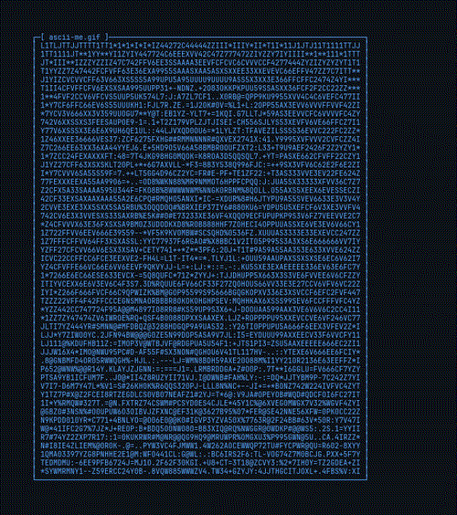

<div align="center">


<br/>


<br/><br/>

<a href="mailto:ranitmondal197@gmail.com">

</a>

<a href="https://www.linkedin.com/in/ranitmmondal/">

</a>

<a href="https://ranitportfolio.vercel.app/">

</a>

<br/><br/>


</div>

---

# 🚀 About Me

<table>
<tr>

<td width="42%" align="center" valign="middle">



</td>

<td width="58%" valign="top">

```bash
#!/bin/bash

USER="Ranit Mondal"

ROLE=(
  "DevOps Engineer"
  "Cloud Engineer"
  "Full Stack Developer"
)

EDUCATION="B.Tech CSE (Data Science)
Dr. B.C. Roy Engineering College
2022-2026"

FOCUS=(
  "Kubernetes"
  "AWS"
  "Terraform"
  "GitOps"
  "CI/CD"
  "Observability"
)
echo "[+] Identity loaded successfully."
echo "[+] Mission: Build. Automate. Scale. Ship."
```


</td>

</tr>
</table>

---

# ⚡ Terminal

<table>
<tr>

<td width="42%" align="center" valign="middle">


</td>

<td width="58%" valign="top">

```bash
$ whoami

Ranit Mondal

$ role

DevOps Engineer
Cloud Engineer
Full Stack Developer

$ current_focus

Kubernetes
AWS
Terraform
ArgoCD
GitHub Actions
Prometheus
Grafana


$ status

Learning. Building. Shipping.
```

</td>

</tr>
</table>
---

# 🛠️ Tech Arsenal

<div align="center">

### ☁️ Cloud & Infrastructure


### ⚙️ Backend & AI


### 🎨 Frontend


### 🗄️ Databases & Languages


</div>

---

# 🚀 Featured Projects

<table>
<tr>

<td width="50%">

### ⚖️ LAW GLANCE

AI-powered legal services platform.

**Stack**

Firebase • FastAPI • Gemini API • Docker

**Highlights**

- 40% faster legal search
- Offline legal rights lookup
- Real-time lawyer booking
- 3-tier RBAC architecture

</td>

<td width="50%">

### 💬 FlashChat

Cloud-native messaging platform.

**Stack**

Kubernetes • Redis • Socket.IO • ArgoCD

**Highlights**

- Zero downtime deployments
- 100% observability coverage
- 90% faster releases
- Production-grade monitoring

</td>

</tr>

<tr>

<td width="50%">

### 🧩 Collaborative Coding Platform

Real-time collaborative editor.

**Stack**

Yjs • AWS ECS • Docker • ECR

**Highlights**

- 10+ concurrent users
- CRDT synchronization
- No merge conflicts
- 80% lower deployment effort

</td>

<td width="50%">

### 🧠 GenAI Resume Intelligence

AI-powered career assistant.

**Stack**

Gemini API • GitHub Actions

**Highlights**

- Resume analysis
- Job matching
- Skill-gap detection
- Learning roadmap generation

</td>

</tr>
</table>

---

# 📊 GitHub Analytics

<div align="center">


<br/>


</div>

---

# 📈 Contribution Activity

<div align="center">


</div>

---

# Contribution Snake

<div align="center">


</div>

---

# 📚 Research

### Advancing Lung Cancer Diagnosis and Prognosis

Accepted at **CICBA 2024**

Machine Learning based diagnostic and prognostic framework for lung cancer analysis.

---

# 🎯 2026 Goals

```text
☁️ Master AWS Architecture
⚙️ Build Production Kubernetes Clusters
🚀 Become a DevOps Engineer
🤖 Build AI Agent Applications
📈 Contribute to Open Source
🏆 Land a High-Impact Engineering Role
```

---

<div align="center">

## 📫 Let's Connect

<a href="mailto:ranitmondal197@gmail.com">

</a>

<a href="https://www.linkedin.com/in/ranitmmondal/">

</a>

<a href="https://ranitportfolio.vercel.app/">

</a>

<br/><br/>

### 🚀 Open to DevOps • Cloud • Platform Engineering Opportunities


<<<<<<< HEAD
</div>
=======
</div>
>>>>>>> eb1c96d (new md)
